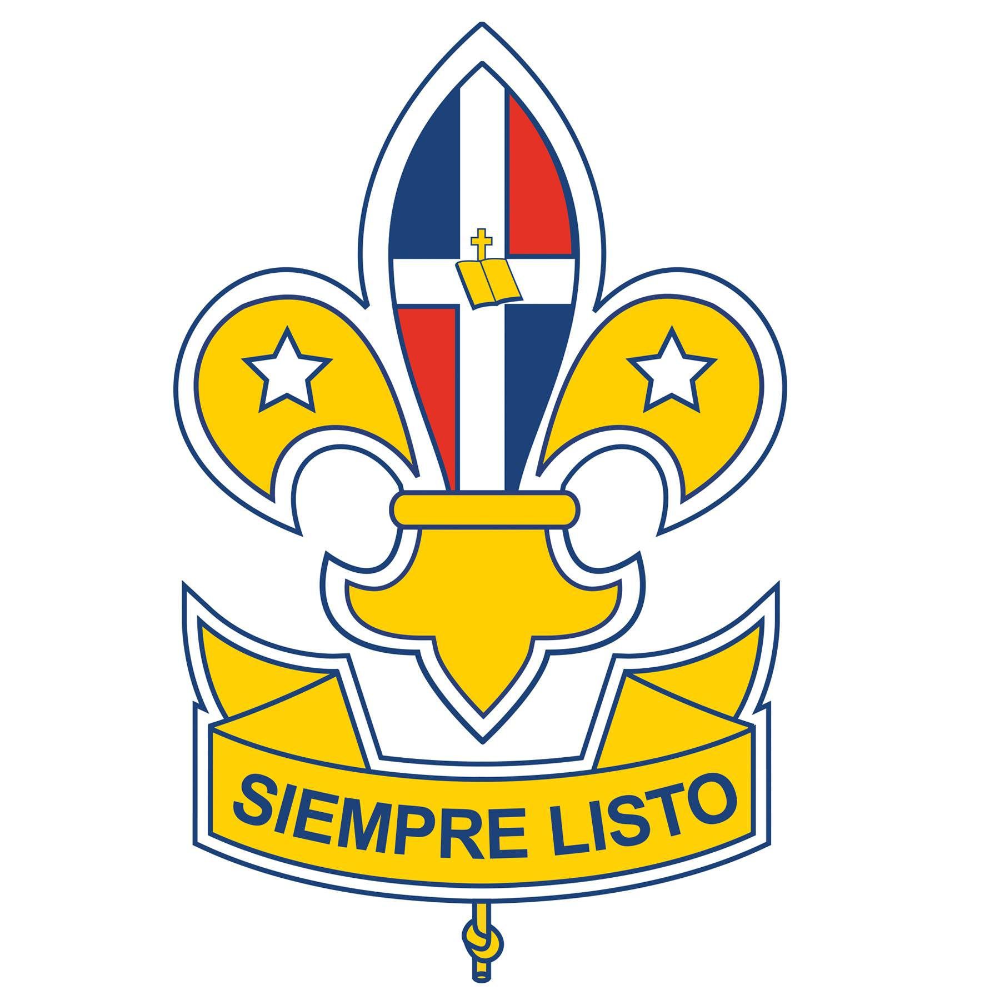
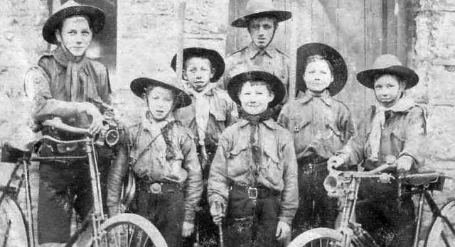
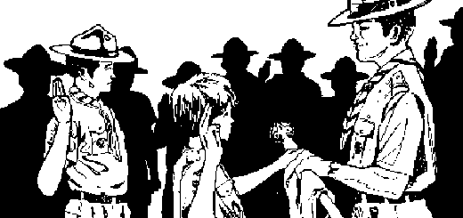
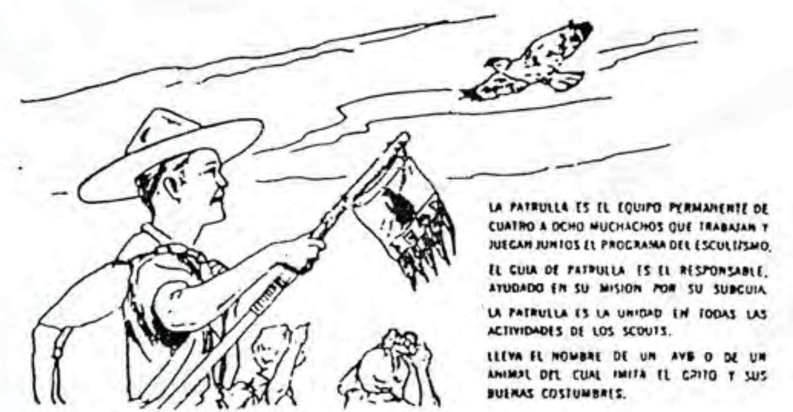

# Espíritu Scout

## Promesa Scout 

:::tip[Promesa scout]
***"Por mi honor y por la gracia de Dios, prometo hacer todo lo posible para con Dios y la patria ayudar al prójimo en toda circunstancia y cumplir fielmente la Ley Scout."***
:::

Prometer por tu honor equivale a comprometerte a cumplir ante Dios y ante tu propia consciencia. No hay que empeñar jamás el honor en una promesa que después no has de cumplir.

Entiendes que la palabra del Scout es sagrada y que pone tu honor por encima de todo.

El Scout pone su voluntad, su fuerza y aún su sacrificio, por cumplir siempre su promesa, sus deberes para con Dios y la Patria, ayudar a su prójimo y realizar todos los días una buena acción.

## Ley Scout

Para el Scout la ley es el código que norma su proceder en la vida. Sus diez artículos son las diez condiciones para que exista un Scout. Cuanto mayor sea el tiempo que permanezcas en la Tropa, encontrarás un significado más profundo en cada uno de sus artículos. Haz lo posible por entenderlos y observarlos. Tu Jefe de Tropa debe
explicarte el significado de cada uno de ellos.

1. **El Scout cífra su honor en ser digno de confianza.**
2. **El Scout es leal con Dios, su Patria, sus Padres, sus Jefes y subordinados.**
3. **El Scout es útil Y ayuda a los demás sin pensar en recompensa.**
4. **El Scout es amigo de todos, y hermano de todo Scout sin dintinción.**
5. **El Scout es amable.**
6. **El Scout ve en la naturaleza la obra de Dios; protege a los animales y a las plantas.**
7. **El Scout obedece sin replicar y hace las cosas en orden y completas.**
8. **El Scout sonríe y canta en sus dificultades.**
9. **El Scout es económico, trabajador y cuidadoso del bien ajeno.**
10. **El Scout es limpio y sano; puro en sus pensamientos, palabras y acciones.**

**NOTA:** *Todos los artículos de la Ley son simples y todos dicen claramente lo que hace un Scout. En ninguno de ellos encontrarás que diga: "El Scout debe ser..." o "El Scout no debe ser...", sino que dice:* **"El Scout es..."**

## Virtudes Scout

Como Scout practicarás esencialmente estas virtudes:

### Lealtad
Es el cumplimiento de lo que exigen las leyes de la fidelidad, del honor y de la hombría del bien.

### Abnegación
Es el sacrificio espontáneo de voluntad, intereses, deseos, gustos y aún de la propia vida, en servicio de Dios o en beneficio del prójimo.

### Pureza
Esta palabra significa ausencia de pecado. Esta virtud recuerda los deberes personales para con Dios Y mantiene el corazón limpio.

## Principios Scout

Son la fuente de inspiración que guía los actos diarios y comunes de tu joven existencia. Tres términos evocan su idealismo: **Dios, Patria y Hogar**.

1. El Scout se honra de su fé y somete a ella su vida.
2. El Scout es hijo de la Patria y buen ciudadano.
3. El deber del Scout principia en su casa.

## Deberes del Scout

La Promesa y la Ley Scout se basan en los valores del Movimiento Scout:

**“Deber para con Dios"** - la relación de una persona con los valores espirituales de la vida, la
creencia fundamental en una fuerza por encima de la humanidad.

**“Deber con los demás”** - relación de una persona con, y de manera responsable parte de la
sociedad en el sentido amplio de la palabra: su familia, la comunidad local, el país y el mundo
en general, así como el respeto por los demás y por el mundo natural.

**"Deber consigo mismo"** - la responsabilidad de una persona para desarrollar su potencial, al
máximo, de acuerdo con sus posibilidades.

## Lema Scout

El lema Scout **"SIEMPRE LISTO"** significa que el Scout debe encontrarse preparado en cuerpo y alma para cumplir en todo momento con su deber.

El Scout, por lo general, tiene algo de lo que carecen los demás jóvenes y que le proporciona una gran ventaja sobre ellos; es la confianza en sí mismo, que le capacita para realizar los más grandes actos de valor, sin vacilación en los momentos críticos.
cuando sea hombre, Sabra como actuar ante un puesto de responsabilidad, porque se fórjo en el crisol Scout para ser el ciudadano útil que la Patria necesita.

## Insignia Scout

La insignia de los Scouts es La **FLOR DE LIS**, adoptada por casi todos los
países del mundo. Se usó por primera vez en el memorable Campamento Brownsea en 1907. Para scout la Flor de Lis significa en conjunto dos cosas:

1. <ins>Nobleza de sentimientos</ins>, por el profundo simbolismo que entrañan sus partes, y
2. <ins>Orientación segura</ins>, porque un scout puede señalar cualquier rumbo como lo hace la aguja de la brújula, siguiendo el camino recto hacia el objetivo que debe alcanzar. 

Los tres pétalos, como los tres dedos de la seña, recuerdan los tres puntos de la Promesa Scout:

El pétalo central se encuentra dividido por una línea vertical que figura la aguja imantada, y recuerda que el Scout siempre sabe <ins>encontrar el camino correcto</ins>: este pétalo representa a Dios y a la Patria; el pétalo de la izquierda simboliza el segundo punto de la Promesa: <ins>el servicio al prójimo</ins>, y el de la derecha patentiza el tercer punto: <ins>cumplimiento de la Ley Scout</ins>.

En los pétalos laterales figuran dos estrellas, que guían al Scout por la noche como a los marinos de los siete mares y recuerdan la maravillosa vida que el Scout goza en sus excursiones y campamentos durmiendo al aire libre bajo el cielo estrellado. Cada una de estrellas tiene 5 picos, que dan 10 en suma, Y patentizan los <ins>10 artículos de la Ley Scout</ins>.

Los tres pétalos van unidos por un anillo que significa la <ins>unión de la Hermandad Scout</ins>.

El gallardete situado en la parte inferior (que se usa como insignia de Segunda Clase) está envuelto hacia arriba por sus extremos. Como los labios de un Scout, que siempre están sonrientes, demostrando con ello que está **"SIEMPRE LISTO"** pata cumplir  voluntariamente con su deber o gozar en sus juegos.

La cuerda con un nudo simple que pende de esta tranja, recuerda al Scout la obligación de hacer su **Buena Acción Cotidiana**.

## Historia del Aplauso Scout "Hoja de Té"

Los Scouts somos muy afectos a las costumbres, tenemos costumbres de todo tipo para cada ocasión, para las ceremonias, festejos, fin de año, etc. Una de las costumbres más halagadoras es el aplauso que se ofrece a la o las personas que por algún motivo destacaron de alguna manera, una buena representación o canción en la fogata, su cumpleaños, ganar alguna actividad, llevar a cabo su compromiso, recibir una etapa o competencia, cualquier momento es la excusa perfecta para hacer sentir especial a esa persona.

Aplausos tenemos varios podría nombrar casi un centenar pero el más importante o uno de los más importantes es el tan conocidas hojas de té, el aplauso Scout por excelencia.

Las Hojas de Té tienen su origen, según se nos ha enseñado, en la famosa costumbre inglesa de tomar té, pues bien, en época de guerra, cuando Baden Powell y sus hombres estaban sitiados en Mafeking, todos querían continuar tomando su té a la hora tradicional, pero no querían que el enemigo, o sea los Boers, supieran lo que hacían, así que las mujeres anunciaban que estaba listo el té aplaudiendo al ritmo que conocemos; posteriormente Baden Powell las emplea como un halago en ceremonias Scouts.

Hasta hoy en día seguimos conservando esta tradición, aunque como siempre se empezó a añadirle al final un silbido y un aplauso, la modificación rápidamente empezó a generalizarse, hasta el punto que pareciera muy normal hacerlo así.

Aunque el aplauso original de las damas que anunciaban el te solo era una tercera parte del aplauso original, lo repitieron y el final fue agregado, y para los muchachos de estos tiempos el hacerlas dobles con los pies, en chiflido sigue siendo muy apreciado por ellos incluso al recibir o ser homenajeados, y esto es de los muchachos, lo dijo Baden Powell.

Seguramente en el futuro próximo, muy próximo el aplauso hasta lo estarán bailando y no podremos evitarlo, y para que evitarlo, quizás hasta el mismísimo Baden Powell no se quejaría de esto, al contrario estaría orgulloso de ver como ha sido eventualizado y continuado este gran aplauso.

Un Aplauso Scout... "Hojas de Te" o "Matemático" en algunos otros países...

Algunos dicen que el ‘Hoja de té’ debería ser el aplauso menos escuchado pero el más significativo.

Lo cierto es que este aplauso es conocido y practicado por Scouts de muchas partes del mundo.

Se originó en Inglaterra para felicitar a altas autoridades scouts, con el tiempo fue usada para ceremonias de pase en eventos muy importantes.

### La Letra

Concepto memorístico de la canción con las palmas que se llama Hoja de té:

Se repite la canción al ritmo de las palmas así:

Hoja de té, de té, de té.

Hoja de té, de té, de té.

Hoja de té, Hoja de té, té.

Luego se dan solo las palmadas al ritmo de la canción que se repite mentalmente.
o simplemente se aplaude con la tonada mental.

## Historia de la Pañoleta Scout 

La pañoleta Scout es una pieza del Uniforme Scout hoy muy controversial, ya que presenta una tendencia a ser sustituta del Uniforme Scout como un todo, y muy usada principalmente en "selfies" y decoraciones, dejando de lado su real significado, su verdadero lugar en la tradición Scout, y las múltiples posibilidades de uso para el Servicio a los demás y para el propio beneficio del portador. 

¿Qué es la pañoleta Scout?

Desde su origen, en el mismo origen del Escultismo, la pañoleta es una pieza del Uniforme Scout diseñado por el Fundador, quien la mencionó de manera destacada en su obra Escultismo para Muchachos, indicando, primero, que:

"Cuando vosotros os levantéis por la mañana, recordad que tenéis que hacer una buena acción durante el día. Haced un nudo en vuestra pañoleta o corbata para que os lo recuerde."

Y más adelante, en la misma obra, nos decía en la descripción del Uniforme Scout que:

"En seguida viene la pañoleta doblada en triángulo, con la punta sobre la espalda. Cada Tropa tiene un color diferente de pañoleta y como el honor de la Tropa está ligado a la pañoleta, deberá conservársela limpia y arreglada. Se le conserva unida a la garganta por medio de un anillo hecho de cuerda, metal, hueso o algo por el estilo. La pañoleta protege el cuello de los rayos del sol y puede ser utilizada de muy diversas maneras, como vendaje o como cuerda de salvamento."

(En las primeras ediciones de Escultismo para Muchachos, antes de 1923, no hubo referencia al anillo, ya que antes de la creación del woggle, anillo de pañoleta, a principios de los años 1920, la pañoleta era sujetada al cuello atada con un nudo).

La relación de la pañoleta Scout con la Buena Acción es reforzada en la misma obra, y entonces B.-P. escribe:

"Alguna buena acción deberéis ejecutar todos los días de vuestra vida. Principiad hoy mismo y nunca lo olvidéis mientras viváis. Recordad que el nudo en vuestra pañoleta y en vuestra insignia son recordatorios para que cumpláis con vuestra "Buena Acción" cotidiana. Haced vuestra buena acción, no sólo con vuestros amigos, sino también con los desconocidos."

También, y en la misma obra, B.-P. muestra algunos ejemplos diferentes de cómo la pañoleta Scout puede ser usada como "instrumento" para actividades Scouts, para protegerse del clima, y para Servicio a los demás.

<figure className="w-full my-4">
  
  <figcaption className="mt-2 text-sm text-left underline text-gray-500 dark:text-gray-400">Boy Scouts de Inglaterra en 1909. Se puede observa sus pañoletas sujetadas con nudos.</figcaption>
</figure>

### ¿Cómo se origina la pañoleta Scout?

La pañoleta Scout es parte del mismo origen del Escultismo. B.-P. introduce el Uniforme Scout como un medio de buscar la igualdad entre todos los Boy Scouts, y como elemento base de creación de disciplina y espíritu de grupo.

Al principio, la pañoleta Scout era cuadrada, y se doblaba en dos formando un triángulo. Luego se doblaba "enrrollándola", colocándola en el cuello con la punta atrás del cuello, y sobre el cuello de la camisa del Uniforme Scout, siendo anudada al frente con un nudo simple.

En el cambio del nudo para usar en su lugar el anillo de pañoleta, primó el hecho de que con el anillo la pañoleta se estrujaba menos, por lo que el Scout tenía una presencia uniformada más nítida. También se tomó en cuenta el desarrollo de nuevas habilidades, al tener los Scouts que fabricar y producir sus propios anillos de pañoleta, y más que todo, el hecho de que es más fácil disponer de la pañoleta sacando el anillo rápidamente, que tener que deshacer un nudo para poder usarla en cualquier emergencia. 

Los antecedentes de la pañoleta Scout, previos a la creación del Escultismo, están en la participación de B.-P. en la Segunda Campaña contra los Matabeles, en 1896, antes de la epopeya de Mafeking. En esa ocasión B.-P. trabajó con Frederick Russell Burnham, un explorador de avanzada, un scout, de origen americano, quien había sido contratado por el Ejército Inglés. Ambos se hicieron muy buenos amigos, y B.-P. aprendió de Burham muchas técnicas de exploración militar que éste había aprendido y desarrollado en su país natal, Estados Unidos. 

B.-P. también copió de Burham su práctico estilo de vestir, tomando de él el famoso sombrero de ala ancha y la pañoleta que usaba atada alrededor del cuello para protegerse del Sol, ambos elementos que luego introdujo en su Escultismo para Muchachos.

La pañoleta usada por Burham en Africa era del mismo estilo de la usada por los vaqueros del Lejano Oeste y por la Caballería en Estados Unidos. En muchas otras culturas alrededor del mundo, también se acostumbraba, y se acostumbra, a usar artículos similares a la pañoleta en la vida al aire libre. 

(Burham era considerado, en esa época, "el mejor explorador (Scout) que haya estado en Africa", y fue condecorado varias veces por la Corona Británica. Se involucró activamente en el Escultismo de B.-P., y en los B.S.A., siendo llamado "el Padre del Escultismo Internacional". Pero es materia de otra historia). 

Algunos autores señalan que en la introducción de la pañoleta en el Uniforme Scout, también primó el "ojo de artista" de B.-P., debido a que la pañoleta es el aspecto más llamativo del Uniforme Scout por su colorido.

En cuanto a su tamaño, la pañoleta Scout tradicional corresponde a un triángulo, cortado diagonalmente, de un cuadrado de 32" x 32". (En la actualidad encontramos pañoletas de distintos tamaños, aun dentro de un mismo país, de una misma asociación Scout)

Desde el principio, cada Tropa usaba una pañoleta específica, con un color propio que la identificaba. En algunos casos, y en algunos países, cada Patrulla dentro de una Tropa usaba una pañoleta con diseño propio. Con el desarrollo del Escultismo y su expansión por todo el mundo, se estableció la pañoleta de Grupo Scout, fueron apareciendo las pañoletas nacionales, y las pañoletas institucionales o de cargos, para identificar posiciones en las asociaciones.

La pañoleta Scout es usada por el Scout tan pronto hace su Investidura o Ceremonial de Promesa. En algunas asociaciones se acostumbra que el aspirante la use antes de su Investidura, pero al revés, usándola al derecho tan pronto la realiza. 

### Significado de la pañoleta Scout

En el pasado, y como parte de la tradición Scout, la pañoleta Scout era considerada mucho más que "un artículo decorativo" del Uniforme Scout, y se le asignaba un significado en relación a la Promesa y a la Ley Scouts.

Como todo triángulo, la pañoleta Scout tienen tres lados, cada uno relacionado con los tres elementos centrales de la Promesa Scout: Dios, Patria y los Demás (El prójimo). El lado más largo, sobre el cual se enrrolla la pañoleta, representa los Deberes para con Dios, y es precisamente el lado no visible, "escondido en el interior" del rollo de la pañoleta, de la misma manera en que el Scout mantiene su fe en el interior de su alma. Los otros dos lados de la pañoleta son iguales en sus tamaños, uno representa los Deberes para con la Patria, y el otro significa los Deberes para con los Demás y para con uno mismo.

Su significado en relación a la Ley Scout se asignaba en su enrrollado antes de colocarla en el cuello; se acostumbraba a "enrrollarla" con diez doblados, o vueltas, uno por cada artículo de la Ley Scout. En países donde tenían una Ley Scout con 12 artículos, se acostumbraba a darle 12 vueltas a la pañoleta en su enrrollado. 

Era una excelente manera para que el Scout recordara siempre su Promesa y su Ley Scouts.

### Uso de la pañoleta Scout

A partir de un análisis de lo que indica B.-P. en Escultismo para Muchachos, se puede establecer que la pañoleta tenía las funciones de identificar la pertenencia de un Boy Scout a determinada Tropa, de ofrecer protección al Boy Scout contra inclemencias del tiempo, y para ser usada como instrumento, como equipo, para actividades Scouts y para actividades de Servicio a los demás.

No se podría decir que la pañoleta, por sí sola, tiene la función de identificar a una persona como miembro del Escultismo, o del Movimiento Scout, ya que muchas otras organizaciones juveniles a través del mundo, como los Pioneros de los países socialistas, organizaciones de diversas iglesias, y grupos dedicados a actividades de Vida al Aire Libre, utilizan pañoletas similares a las usadas por los Scouts, algunas de esas organizaciones con sus uniformes propios, y otras sin uniforme alguno, situación ésta que es un riesgo posible para que "los Scouts", usando pañoleta sin Uniforme Scout, sean fácilmente confundidos con miembros de otras organizaciones sin ninguna afinidad.

Los usos prácticos que un Scout pueda dar a su pañoleta son incontables; dependerán de la calidad del adiestramiento Scout que haya recibido, de su experiencia de vida Scout, y de su propia creatividad.

## Pañoleta Grupo Scout Padre Emiliano Tardif, #44

La pañoleta del Grupo Scout Padre Emiliano Tardif, #44; está conformada por 3 colores; <ins>amarrillo</ins>, como base y dos lineas, una <ins>roja</ins> y una <ins>verde</ins>. Su signficado es: 

**Rojo**: La sangre derramada por los compatriotas;

**Verde**: La esperanza;

**Amarrillo**: La luz del sol;

**En conjunto**:

> La sangre derramada por nuestros compatriotas nos dieron la esperanza de volver a ver la luz del sol.

## Ceremonial De La Promesa Scout

El Ceremonial para investir al aspirante que ha pasado satisfactoriamente sus pruebas de Tercera Clase, que tiene su Credencial Scout al dia y que está listo para entrar en el rango Scout, se efectúa de la manera siguiente:

Las patrullas que integran la Tropa hacen una formación de "herradura", se coloca la Bandera Nacional en la boca de la herradura. El Jefe de Tropa y el Subjefe, que le llevan la Pañoleta y el Bordón se colocan en la boca de la herradura frente a la Tropa.

El Guía lleva al aspirante ante el J.T. lo saluda y regresa a ocupar el lugar anterior. El J.T. dice al aspirante:

**¿Entiendo que quieres ser Scout?**, a lo que éste contesta: ***Sí, lo deseo***
El J.T. dice: **"¿Conoces la Ley Scout?"**, el aspirante: ***Sí, la conozco***
J.T. - **"¿Sabes lo que significa tu Honor?"**
Aspirante - **"Significa que se puede confiar en mi lealtad y honradez"**

J.T. - **"¿Puedo confiar por tu honor en que harás cuanto de ti dependa para: Cumplir tus deberes para con Dios y la Patria, ayudar a tu prójimo en toda circunstancia y cumplir la Ley Scout?"**

El aspirante hace el Medio Saludo, así como toda la Tropa, mientras responde repitiendo los términos de la Promesa Scout. Luego el J.T.- dice algunas palabras de bienvenida a la Gran Hermandad Mundial de los Scout e inmediatamente le entrega al nuevo Scout las Insignias de Tercera Clase.

Luego el Subjefe de Tropa le entrega el bordón y el Jefe de Tropa le impone la Pañoleta.

El nuevo Scout da media vuelta y saluda a la Tropa ésta responde al saludo.

Finalmente, el Guía de Patrulla conduce al Nuevo Scout a su patrulla.

## Promesa de Patrulla

De frente a tu Guía de Patrulla y teniendo atrás a los demás Scouts de la Patrulla, coloca tu mano izquierda entre las del J.P. al tiempo que tú y los demás Scout de la Patrulla hacen el medio saludo con la derecha, pronuncia tu Promesa de Patrulla:

:::tip[promesa de patrulla]
<strong style={{ display: "block", textAlign: "center" }}>"Promete obedecerte como guía, quererte como hermano mayor, ser leal a mi Patrulla y no desanimarme jamás".</strong>
:::

Al terminar ésta, tu Guía te prenderá en la costura del brazo izquierdo de la camisa las "Cintas de Patrulla".

#### Bibliografías y Referencias: 

###### Enciso, A. (s.f.). Manual del Pietierno, Asociación de Scouts Dominicanos, Inc. 
###### Garcia Rúa, L. (1/8/2020). Sitio Web Pitalito7, historia, significado y uso de la pañoleta Scout. https://pitalito7.wixsite.com/scouts/post/historia-significado-y-uso-de-la-pa%C3%B1oleta-scout
###### 10,487.- Amigos del Grupo IV (10/4/2016) EL APLAUSO DE LAS HOJAS DE TÉ. Facebook. https://www.facebook.com/photo?fbid=986101084760429&set=a.104954636208416&locale=es_LA
