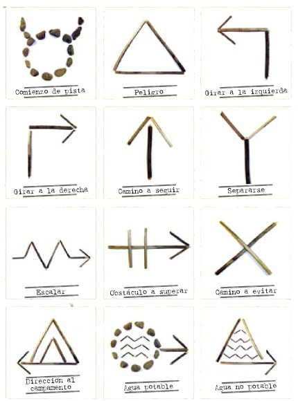
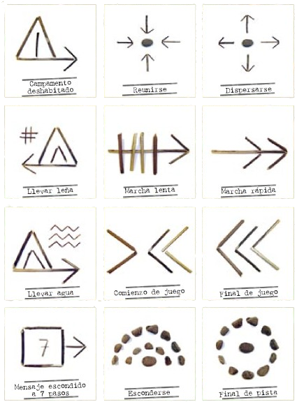
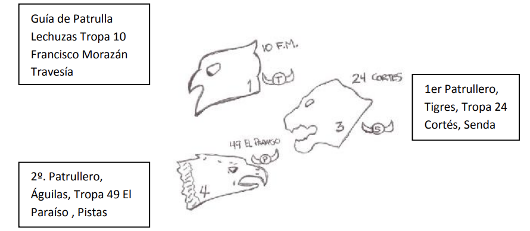

# Observación

Las señales de pista son un lenguaje secreto que permite a los Scouts dejar para los que les siguen indicaciones precisas sobre la manera de alcanzarlos en un lugar determinado.

## Trazado y seguimiento de señales de pistas.

Al trazar o seguir una pista de signos artificiales, debes considerar que:

1. Debes hacer perfectamente las señales en el suelo con la punta del bordón o el cuchillo, en las rocas y árboles, con tiza o carbón.
2. Deben ser bien visibles, pero gue no llamen mucho la atención, para que no sean borradas por personas desconocidas.
3. La distancia entre una señal y otra debe ser, en lugares difíciles de observar, de 10 metros; en sitios rocosos de 30 en 30 mts. en las matas de 40 en 40, en los campos y veredas, hasta mãs de 100 mts.
4. Si se ha de atravasar un pueblo, se deja a la entrada una carta escondida que indique con precisión el lugar donde continuará la pista.
5. Nunca se harán las señales de pista en propiedades ajenas, como en las paredes de las casas, ni sobre objetos móviles, que puedan encontrarse momentáneamente parados.
6. Debes recodar exactamente la colocación de la última señal.
7. Hay que seguir la pista a paso moderado, porque corriendo puedes omitir algunas señales.
8. El último en pasar borrará todas las señales y recogerá las cartas o mensajes y demãs objetos extraños al lugar, que se hayan empleado al trazar la pista.

### Cuadro de las señales de pista

Algunas de las señales de pista más usadas:

## Firma de patrulla

Cada Scout de una patrulla tiene un esquema característico que indica claramente quién es, y que emplea para firmar sus trabajos, cartas, informes, etc..., relacionados con el Escultismo.

Estos signos tienen por base el contorno de las siluetas de Patrulla. 

Los Scouts de la Patrulla deben estar numerados de la manera siguiente: #1 (guía), #2 (subguía), #3 (secretario/a), etc... Este número se sitúa dentro del contorno del animal.

El número del Grupo Scout, la ciudad o localidad a la que pertenece, se indican en la parte superior derecha del esquema.

En la parte inferior derecha se presenta la clase Scout: Tercera, Segunda o Primera clase, encerrado el número correspondiente en una circunferencia al lado.

#### Bibliografías y Referencias: 

###### Enciso, A. (s.f.). Manual del Pietierno, Asociación de Scouts Dominicanos, Inc. 
