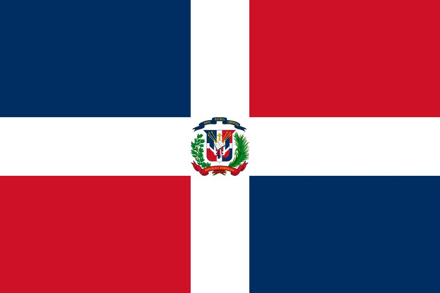
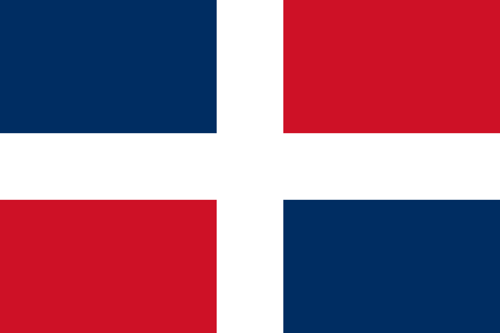
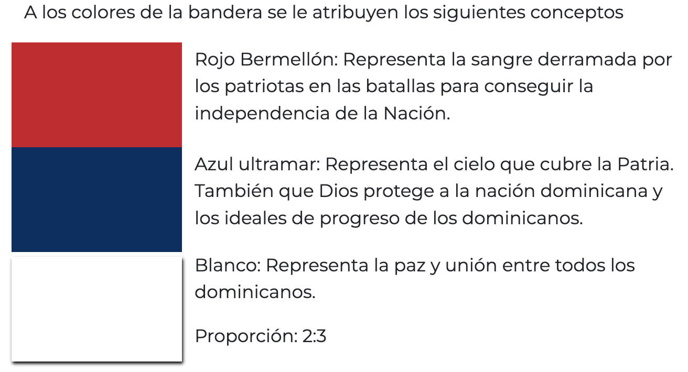
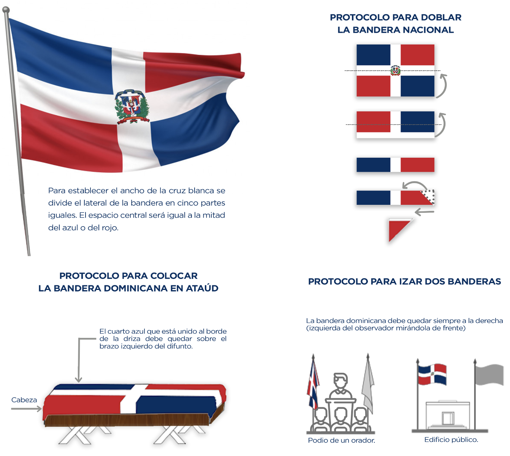
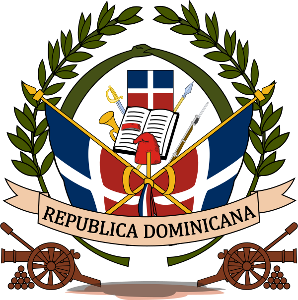
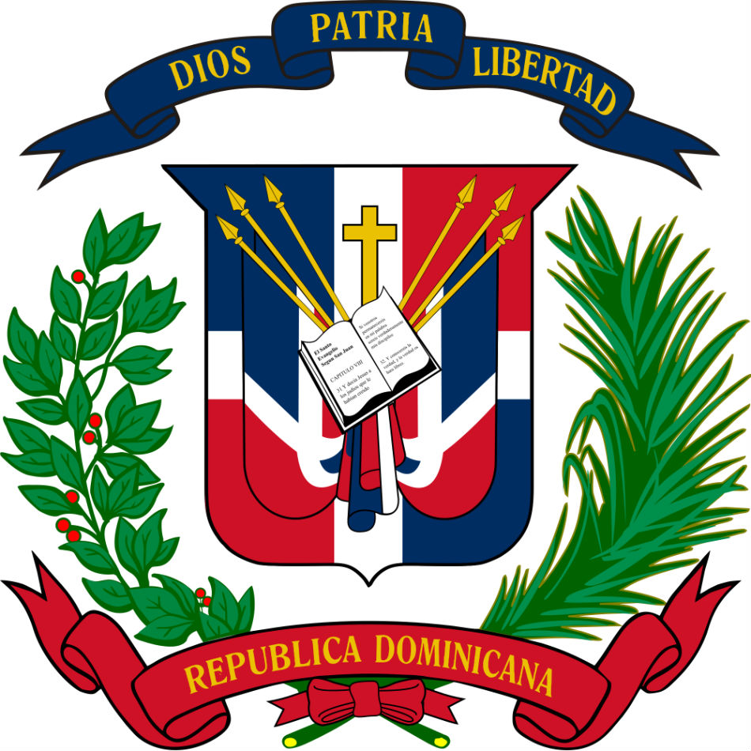
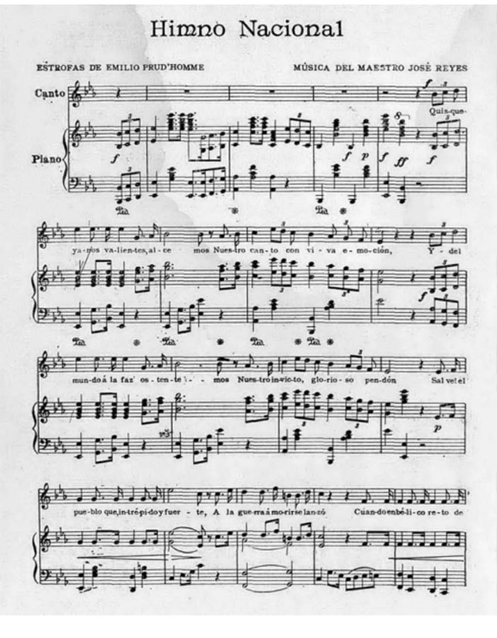

# Civismo

## Bandera Nacional

Con trazos ideados por Juan Pablo Duarte, la Bandera Nacional Dominicana fue definida claramente en el juramento de los Trinitarios:

"En nombre de la Santísima, augustísima e indivisible Trinidad de Dios Omnipotente: juro y prometo, por mi honor y mi conciencia, en manos de nuestro presidente Juan Pablo Duarte, cooperar con mi persona, mi vida y bienes a la separación definitiva del gobierno haitiano y a implantar una República soberana e independiente de toda dominación extranjera, que se denominará República Dominicana. La cual tendrá su pabellón tricolor en cuadros encarnados y azules atravesado con una cruz blanca. Mientras tanto, seremos reconocidos los trinitarios con las palabras sacramentales de **‘Dios, Patria y Libertad’**. Así lo prometo ante Dios y el mundo. Si tal hago, Dios me proteja y si no, me lo tome en cuenta, y mis conocidos me castiguen el perjurio y la traición, si lo vendo”.

### Las características de nuestra bandera son las siguientes

- Es una bandera con formato rectangular, con dos rayas blancas en forma de cruz, cuyos brazos se extienden hasta los extremos.
- En la intersección de las rayas blancas está colocado el Escudo Nacional. 
- La cruz divide la bandera en cuatro cuarteles: dos azules y dos rojos, alternados, dispuestos de manera que el primer cuartel, aquel situado junto al asta y que está unido al tope, sea azul. 
- La relación ancho/largo es de 2:3 (por cada 2 unidades de ancho tendrá 3 unidades de largo). 

<figure className="w-full my-2">
  
  <figcaption className="mt-2 text-sm text-left underline text-gray-500 dark:text-gray-400">Bandera de la República Dominicana</figcaption>
</figure>

### La primera bandera

La primera distribución de esos colores fue hecha por Juan Pablo Duarte, quien concibió el diseño original, y el  día 16 de julio de 1838 obtuvo la aprobación de los trinitarios para la confección de la misma. Duarte colocó una franja azul en el margen superior de la bandera y una franja roja en el inferior, colocando la cruz blanca al centro de la misma.

Esta fue confeccionada por varias mujeres, entre ellas, María Trinidad Sánchez, María de Jesús Pina, Isabel Sosa y Concepción Bona. La primera bandera ondeó airosa por vez primera el 27 de febrero de 1844, día de la Independencia Nacional.

Luego, el 6 de noviembre de 1844, el Congreso Constituyente promulgó la Primera Constitución de la República, en la que quedó adoptada la Bandera Nacional como símbolo de la Patria, alternando un cuartel azul por rojo, para hacerla más armoniosa y una de las más bellas banderas del mundo.

<figure className="w-full my-4">
  
  <figcaption className="mt-2 text-sm text-left underline text-gray-500 dark:text-gray-400">Primera bandera de la República Dominicana</figcaption>
</figure>

### Protocolo

El uso de la bandera dominicana está regulado esencialmente por la ley 360 de 1943, sus modificaciones y decretos. Estos estipulan lo siguiente:

*El lado frontal de la bandera es aquel en el cual el cuartel azul queda a la izquierda del observador.*

*La bandera nunca tocará el suelo.*

*La bandera será enhestada todos los días laborables en todos los edificios y dependencias oficiales del estado, desde la salida hasta la puesta del sol.*

La bandera no debe exhibirse en mal estado (ni rasgada, ni maltratada, ni sucia...).

Es un deber de todo dominicano exhibir la bandera en los días de fiestas patrias (27 de febrero, 16 de agosto, por ejemplo).

Cuando la bandera se ice junto a otra, debe quedar siempre a la derecha (izquierda del observador mirándola de frente).

Cuando la bandera sea colocada en forma vertical, el cuartel azul de la esquina superior, el que está unido al borde grueso de la driza, deberá quedar a la izquierda del observador.

Cuando la bandera sea colocada horizontalmente sobre una pared la bandera deberá colgarse de modo que el cuartel superior azul que está unido al borde derecho de la driza, quede a la izquierda del observador.

Es un deber de todo dominicano exhibir la bandera en los días de fiestas patrias (27 de febrero, 16 de agosto, por ejemplo).

Cuando la bandera se ice junto a otra, debe quedar siempre a la derecha (izquierda del observador mirándola de frente).

Cuando la bandera sea colocada en forma vertical, el cuartel azul de la esquina superior, el que está unido al borde grueso de la driza, deberá quedar a la izquierda del observador.

Cuando la bandera sea colocada horizontalmente sobre una pared la bandera deberá colgarse de modo que el cuartel superior azul que está unido al borde derecho de la driza, quede a la izquierda del observador.

## Escudo Nacional

El escudo de armas de la República Dominicana es el emblema heráldico que representa al país y que, junto con la Bandera y el Himno Nacional, tiene la categoría de símbolo patrio.

### Reseña Histórica

Creado en la época de la proclamación de independencia nacional, en 1844, la historia registra 21 escudos incluyendo el actual, tras experimentar un largo proceso de modificaciones.

### El primer escudo de armas

Este tenía dos ramas exteriores de laurel y debajo de éstas, formando un arco, aparecía una serpiente mordiendo y tragando su cola (signo de eterna evolución. En primer plano, en la parte inferior, había una cinta ancha con las palabras "República Dominicana”. A ambos lados en la parte inferior, dos cañones con sus respectivas balas esféricas en forma piramidal.

El escudo de la República Dominicana fue creado en la época de la proclamación de independencia nacional, en 1844.

El mismo ha experimentado un largo proceso de modificaciones sucesivas. La historia registra 21 escudos incluyendo el actual.

El primer escudo de armas tenía dos ramas exteriores de laurel y debajo de éstas, formando un arco, aparecía una serpiente mordiendo y tragando su cola (signo de eterna evolución).

En un tercer plano aparecía, abierto y en el centro, el libro de los Evangelios; detrás del libro había un trofeo de armas (una lanza y un fusil con bayoneta calada a la derecha, y un sable y una corneta a la izquierda); arriba del libro había una bandera dominicana. En segundo plano habían dos banderas dominicanas y, en el cruce de las astas, había un gorro frigio (símbolo de la libertad).

En primer plano, en la parte inferior, había una cinta ancha con las palabras «República Dominicana» y, a ambos lados en la parte inferior, dos cañones con sus respectivas balas esféricas en forma piramidal.

Constituciones, leyes y decretos posteriores fueron modificando la estructura del escudo: se eliminaron los cañones (**Constitución del 6 de noviembre de 1844**), sustitución de una rama de laurel (primero por una de parra en 1848 y luego por una hoja de palma desde 1853), la bandera central fue sustituida por una cruz (1853), desaparición del trofeo de armas, del gorro frigio y de la serpiente, cuatro banderas cruzadas en lugar de dos, etc.

Solamente a partir del año 1913 se oficializó una uniformidad heráldica mediante el decreto del 6 de febrero de 1913, expedido por el gobierno de Monseñor Nouel, que establecía la forma actual. En el mismo decreto aparecía un diseño, hecho por Casimiro Nemesio de Moya, reproduciendo el **«Gran Sello de la Nación»**.

Además de la forma, dicho decreto fijó, en su artículo segundo, los colores actuales: azul ultramar y rojo bermellón.

<figure className="w-full my-4">
  
  <figcaption className="mt-2 text-sm text-left underline text-gray-500 dark:text-gray-400">Primer Escudo Nacional</figcaption>
</figure>

### Escudo Actual

La existencia del escudo está consagrada en la constitución de la república, que lo describe de la manera siguiente:

Artículo 32.- El Escudo Nacional tiene los mismos colores de la Bandera Nacional dispuestos en igual forma. Lleva en el centro la **Biblia abierta en el Evangelio de San Juan**, capítulo 8, versículo 32, y encima una cruz, los cuales surgen de un trofeo integrado por dos lanzas y cuatro banderas nacionales sin escudo, dispuestas a ambos lados; lleva un ramo de laurel del lado izquierdo y uno de palma al lado derecho.

Está coronado por una cinta azul ultramar en la cual se lee el lema **“Dios, Patria y Libertad”**. En la base hay otra cinta de color rojo bermellón cuyos extremos se orientan hacia arriba con las palabras “República Dominicana”.

La forma del Escudo Nacional es de un cuadrilongo, con los ángulos superiores salientes y los inferiores redondeados, el centro de cuya base termina en punta, y está dispuesto en forma tal que resulte un cuadrado perfecto al trazar una línea horizontal que una los dos verticales del cuadrilongo desde donde comienzan los ángulos inferiores.

<figure className="w-full my-4">
  
  <figcaption className="mt-2 text-sm text-left underline text-gray-500 dark:text-gray-400">Escudo Nacional</figcaption>
</figure>

## Himno Nacional

El himno nacional de la República Dominicana es la composición musical patriótica que representa al país y que, junto con la bandera y el escudo, tiene la categoría de símbolo patrio.

### Composición

Letra: Emilio Prud’Homme
Música: José Reyes
Adoptado: 30 de mayo de 1934

Su letra fue compuesta por Emilio Prud’Homme y la partitura musical del Himno fue creada por el Maestro José Reyes en 1883, quien le pidió a Prud'Homme que escribiera unos versos patrióticos que acompañaran sus compases.

La música tuvo un éxito instantáneo, de tal forma que cuando los restos del libertador de la República Dominicana, Juan Pablo Duarte, fueron traídos desde Venezuela en 1884, se escogió la música compuesta por el maestro Reyes.

Con las letras no sucedió lo mismo. Las letras de Emilio Prud’Homme contenían errores en referencias históricas y algunos defectos de métrica. Varios intelectuales dominicanos de la época criticaron esas letras e incluso escribieron nuevos versos que acompañaran la música del himno. 

En 1897, Emilio Prud’Home presentó de forma pública una versión corregida de sus letras originales, que terminó con los debates y fue aceptada por todos. Son las letras actuales del himno. 

Ese mismo año, el presidente Ulises Heureaux envió un proyecto de ley al Congreso para adoptar como el himno nacional dominicano, y se comenzó a usar en todas las ocasiones oficiales, pero Heureaux fue asesinado en 1899 antes de tener ocasión de promulgarlo.

La extraordinaria convulsión política del inicio del siglo XX en la República Dominicana impidió que se tomaran acciones sobre los símbolos de la Patria. Pero en 1934 el Congreso adoptó la composición de Emilio Prud’Homme con la música de José Reyes como el Himno Nacional dominicano.

### Primera interpretación en público

La primera versión del himno se interpretó por primera vez el 17 de agosto de 1883 en los salones de la Respetable Logia Esperanza Nº. 9, en la ciudad de Santo Domingo, capital de la República Dominicana. La segunda ciudad donde pudieron escucharse las notas musicales del himno nacional dominicano fue Azua.

  

    Quisqueyanos valientes, alcemos nuestro canto con viva emoción. Y del mundo a la faz ostentemos nuestro invicto glorioso pendón. ¡Salve! el pueblo que, intrépido y fuerte, a la guerra a morir se lanzó, cuando en bélico reto de muerte sus cadenas de esclavo rompió.

    Ningún pueblo ser libre merece si es esclavo indolente y servil; si en su pecho la llama no crece que templó el heroísmo viril, mas quisqueya la indómita y brava siempre altiva la frente alzará; Que si fuere mil veces esclava otras tantas ser libre sabrá.

    Que si dolo y ardid la expusieron de un intruso señor al desdén, ¡Las Carreras! ¡Beller!, campos fueron que cubiertos de gloria se ven. Que en la cima de heroico baluarte de los libres el verbo encarnó, donde el genio de Sánchez y Duarte A ser libre o morir enseñó.
  

  

    Y si pudo inconsulto caudillo de esas glorias el brillo empañar, de la guerra se vio en capotillo La bandera de fuego ondear. Y el incendio que atónito deja de castilla al soberbio león, de las playas gloriosas le aleja donde flota el cruzado pendón.

    Compatriotas, mostremos erguida nuestra frente, orgullosos de hoy más; que quisqueya será destruida pero sierva de nuevo, ¡jamás! que es santuario de amor cada pecho do la patria se siente vivir; Y es su escudo invencible: el derecho; y es su lema: ser libre o morir.

    ¡Libertad! que aún se yergue serena La Victoria en su carro triunfal, Y el clarín de la guerra aún resuena pregonando su gloria inmortal. ¡Libertad! Que los ecos se agiten mientras llenos de noble ansiedad nuestros campos de gloria repiten ¡Libertad! ¡Libertad! ¡Libertad!
  

<audio controls className="mx-auto my-6">
  {/* <source src="./assets/audio/dominican-anthem.mp3" type="audio/ogg">
  <source src="./assets/audio/dominican-anthem.mp3" type="audio/mpeg"> */}
Tu dispositivo no soporta este archivo.
</audio>

## Poderes del Estado

El Gobierno de la República Dominicana se basa en una democracia representativa. Se divide en tres ramas gubernamentales independientes una de la otra: **el Poder Ejecutivo, el Poder Judicial, y el Poder Legislativo**.

El **Poder Ejecutivo** está encabezado por el presidente, quien es elegido por voto directo para un mandato de 4 años y puede optar por un segundo período constitucional consecutivo, sin la posibilidad de volver a postularse al cargo. El presidente nombra al Gabinete y a los gobernadores de las 31 provincias. Ejecuta las leyes aprobadas por el Poder Legislativo y es el comandante en jefe de las Fuerzas Armadas. Los alcaldes y regidores municipales también son elegidos por voto directo para un mandato de 4 años para administrar los 124 municipios y el Distrito Nacional (Santo Domingo).

El **Poder Legislativo** consiste en un Congreso bicameral compuesto por el Senado, con 32 miembros, y la Cámara de Diputados, con 178 miembros. Los miembros de ambas cámaras son elegidos por el voto directo de la provincia correspondiente.

El **Poder Judicial** es administrado por la Suprema Corte de Justicia, la cual está compuesta por 16 jueces nombrados por el Consejo Nacional de la Magistratura, una entidad creada para garantizar la independencia de los otros poderes del Estado. El Consejo Nacional de la Magistratura, según lo declarado por la Constitución, debe tener como miembros a representantes del partido oficial, del partido de la oposición y de la Suprema Corte de Justicia.

## Oración Scout

> **Señor,  enséñame a ser generoso,  a servirte como lo mereces, a dar sin medida, a combatir sin temor a las heridas, a trabajar sin descanso, a no buscar más recompensa y saber que hago por tu santa voluntad, amén.**

Esta plegaria, que ha sintetizado el ardor del Espiritu scout. rezada por todos los Scouts al comenzar sus reuniones y al finalizarlas, cualquiera que sea su denominación religiosa.

#### Bibliografías y Referencias: 

###### Enciso, A. (s.f.). Manual del Pietierno, Asociación de Scouts Dominicanos, Inc. 
###### Símbolos Patrios. Página web de Presidencia de la República Dominicana. https://www.presidencia.gob.do/acerca-de-rd/simbolos-patrios
###### Símbolos Patrios. Página web del Ministerio de Relaciones Exteriores de la República Dominicana. https://mirex.gob.do/simbolos-patrios/