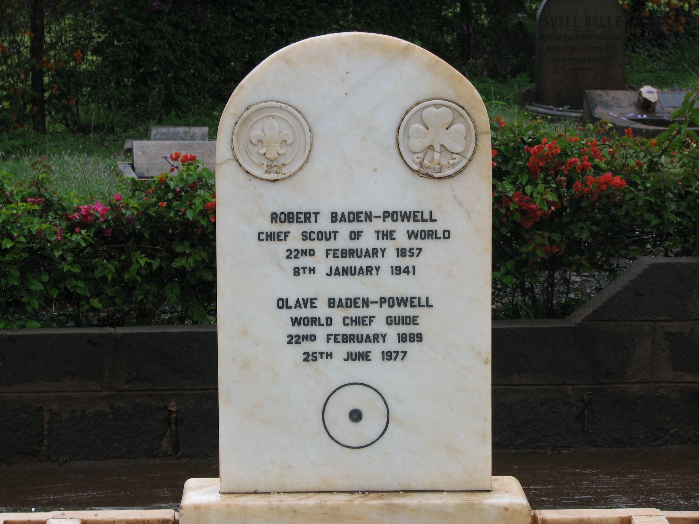

# Conocimiento del Escultismo

## Historia del Escultismo Mundial

Para conocer la historia del Escultismo, es indispensable que conozcas algo de historia de su fundador, **Sir Lord Robert Baden-Powell**, o **BP** como lo llamamos cariñosamente los scouts.

Robert Stephenson Smith Baden Powell, nació en Londres el 22 de febrero de 1857; fue el hijo menor de una familia de siete hermanos, perdió a su padre siendo muy pequeño y debió, junto a sus hermanos, aprender a valerse por sí mismo. A los 12 años recibió una beca e ingresó al colegio Charterhouse. Allí fue uno de los estudiantes más activos. Siempre se destacaba por su simpatía y su capacidad para actuar en las obras de teatro. Con frecuencia se escapaba al bosque vecino al colegio, allí observaba los animales y las plantas pues era amante de la naturaleza; muchas veces debía esconderse para evitar ser descubierto por los cuidadores del colegio. A los 19 años, entró en la academia militar de Sandhurst y a mediados de diciembre desembarcó en Lucknow, India, como subteniente del XIII de Húsares.

En mayo de 1899 recibía el grado de Mayor por sus grandes campañas en India y África. Ese mismo año recibió la orden de volver a Sudáfrica en misión especial: reclutar un contingente policial que debería patrullar la frontera noroeste. El 11 de octubre estalló la guerra contra los Bóers y B.P. defiendió la ciudad asediada de Mafeking. Esta pequeña ciudad representaba, según el Alto Mando, la llave para la entrada a África del Sur, por lo que su defensa era vital para los planes del Imperio Británico. Sin embargo, los datos eran aplastantes: mientras que B.P. contaba con apenas 1.250 hombres, y solo cuatro cañones; el ejército de los Bóers (colonos holandeses que luchaban contra los ingleses) contaba con más de 9.000 hombres y un arsenal considerable, por lo que sus comandantes entendían que la ciudad se rendiría rápidamente al sitio impuesto.

Frente a este panorama, B.P. entendió que necesitaría contar con todos los medios y los hombres posibles para sostener el sitio hasta que las tropas inglesas llegaran. Para lo primero se valió de su inteligencia: con partes de una locomotora armó un nuevo cañón, dispuso maniquíes para aparentar tener más soldados frente al enemigo, ordenaba ataques ficticios durante las noches para que el ejército de los Bóers no descansara, etc. Para lo segundo conformó con todos los jóvenes que no tenían edad para ser soldados, y les dio la tarea de llevar los mensajes y órdenes, hacer de centinelas y ayudar en la distribución de alimentos y medicinas (con lo que pudo ocupar en la batalla a los hombres que se encargaban de cumplir estas funciones). Con gran coraje y responsabilidad, incluso bajo fuego enemigo en sus bicicletas, sorteaban los inconvenientes y cumplían con lo ordenado. B.P. se dio cuenta de que cuando a un joven se le da una responsabilidad, éste pone mucho empeño en cumplirla. Este razonamiento fue el principio del Movimiento Scout.

217 días después las tropas británicas liberaban a Mafeking de su sitio. Al regresar a Inglaterra, convertido en un héroe nacional, Baden Powell encontró que su libro “Aids to Scouting” (escrito en 1899), destinado a la formación de militares tenía gran éxito ente todos los muchachos. De hecho se había convertido en todo un éxito, utilizado por maestros y diferentes organizaciones. Decidió entonces escribir uno especialmente dedicado para la juventud, y en agosto de 1907 B.P. organizó un campamento del 15 de julio al 9 de agosto de 1907 para probar sus textos, en la pequeña isla de Brownsea, con 22 muchachos divididos en cuatro patrullas: Cuervos, Lobos, Toros y Chorlitos. Su método de organización es conocido ahora como <ins>‘El Sistema de Patrullas”</ins>, parte principal de su entrenamiento scout, involucra a los chicos a organizarse ellos mismos en grupos pequeños con un líder de patrulla electo por ellos.

A partir de enero de 1908 B.P. publica seis entregas quincenales en formato de revista para jóvenes. Tal fue el éxito de ventas que luego fueron compiladas en un libro: Scouting for Boys (Escultismo para muchachos), que hoy es considerado la primera presentación del programa y método del escultismo. A su vez, en cada lugar que se presentaba el libro a los jóvenes, éstos ya estaban formando espontáneamente patrullas scouts y le pedían ayuda a Baden-Powell. Rápido de reflejos, B.P. los animó, y el Movimiento Scout comenzó su desarrollo. Sorprendido por la repercusión obtenida, realizó un segundo campamento experimental en Humbshaugh, Northumberland; en éste se perfeccionó el Sistema de Patrullas y se implementaron nuevos juegos, perfeccionando la organización y el modelo educativo. Posteriormente, Roland Philipps escribe el libro “El Sistema de Patrullas” que presenta este elemento fundamental del Método Scout.

Al siguiente año, junto con su hermana Agnes, publica dos libros: “Pamphlet A: Baden-Powell Girl Guides, a Suggestion for Character Training for Girls” y “Pamphlet B: Baden-Powell Girl Guides, a Suggestion for Character Training for Girls”; los que se consideran como precursores del movimiento juveni femenino. Ya en 1910 habían más de 6.000 Guías solo en Gran Bretaña. El mismo año, B.P. renunció finalmente al ejército inglés para dedicarse de lleno al escultismo, realizando una gira por todo el mundo para visitar las diferentes expresiones scouts que estaban surgiendo.

B.P. era un hombre inquieto y, por otra parte, su creación se desarrollaba a un ritmo acelerado. Pronto surgió la inquietud: ¿qué hacer con los hermanos pequeños de los scouts, que les acompañaban con gran entusiasmo en muchas de sus operaciones y actividades?. En 1915 algunos Grupos ya habían comenzado a trabajar con niños más pequeños, adaptando de facto el programa de los scouts. Una dirigente destacada, considerada luego la primera Akela, Vera Barclay publicó ese año un artículo en la revista scout Headquarters Gazette’ titulado Cómo puede una señorita educar lobatos donde refiere sus primeros pasos en la Manada de Hertford, al norte de Londres. El 16 de junio de 1916 Baden-Powell organiza una reunión en Caxton Gill donde presenta a un grupo de dirigentes destacados su idea de modificar la primera edición de su Manual del Lobato (Wolf Cub Handbook) para incorporarle la obra de El libro de las Tierras Vírgenes (The Jungle Book) de Rudyard Kipling como fondo motivador.

Robert Baden-Powell no podía aconsejar a todos los jóvenes que le escribían y se acercaban solicitándole su ayuda. El año 1919 marca dos hitos en el papel que adquieren los voluntarios adultos en el naciente movimiento juvenil. En primer lugar escribió un breve libro, casi un folleto, para ayudar a los dirigentes llamado Guía para el Jefe de Tropa (Aids to Scoutmastership). Para asegurar la buena dirección del adulto, complementó dicha publicación con un entrenamiento apropiado a través de unl curso de instrucción conocido como de la insignia de madera. Para tener un lugar adecuado donde realizar las prácticas, la familia de Keneth MacLaren, uno de sus asistentes en el campamento de Brownsea, ayuda con una generosa donación en la compra del campo de instrucción de ‘Gilwell Park’ en 1919. Allí desde ese mismo año se realizan los cursos de formación para jefes scouts.

En 1920 se celebra el <ins>I Jamboree Scout Mundial</ins> de la historia celebrado en Olympia, Londres (Reino Unido). Baden Powell pensó que sería interesante convocar cada cierto tiempo a scouts de diferentes países y territorios. Para esta actividad se le ocurrió la denominación de Jamboree. Desde el 30 de Julio hasta el 7 de Agosto más de 8.000 scouts de 34 países realizaron talleres, exhibiciones de técnicas scouts y toda clase de juegos. La última noche del Jamboree Baden-Powell fue proclamado Jefe Scout del Mundo.

Posteriormente, B.P. observó que algunos muchachos tenían que abandonar la tropa scout al cumplir los diecisiete años, por lo que creó, en 1922, una etapa especial para jóvenes llamada roverismo, escribiendo para éstos su obra “Roverismo hacia el éxito“.

Al cumplir 80 años, su fuerzas comenzaron a declinar. Regresó a África en compañía de su esposa; para entonces, había más de dos millones de scouts repartidos por todo el mundo. Se establecieron en Nyeri, Kenya, lugar en el cual Baden Powell murió el 8 de enero de 1941 (un poco más de un mes antes de cumplir sus ochenta y cuatro años); un grupo de soldados y scouts lo llevaron hasta el Monte Kenya.

Hoy, más de 100 años después de su creación, el Movimiento Scout cuenta con más de 40 millones de miembros (entre niños, jóvenes y adultos), y se encuentra en 160 países y territorios; transformándolo en el movimiento voluntario más grande del mundo.

## Historia del Escultismo en República Dominicana

Corría el año de 1914, comienzo de la 1ra Guerra Mundial. San Pedro de Macorís vivía la
época de bonanza económica y cultural que le llevaría a ser llamada “La Tácita de Oro” y “El
Paris Chiquito”. La juventud devoraba ansiosamente textos llegados por su dinámico puerto,
el más importante del país. Los últimos libros editados en Europa y Estados Unidos, los diarios
de New York, Inglaterra, España y Francia llegaban con normalidad a Macorís del Mar. Es
entonces cuando cae en las manos de Raúl Francisco Aybar, Director de la Escuela Normal
de la ciudad, un número de una revista española recién llegada a la Librería Cervantes. La
revista tenía por nombre “El Explorador Español” y se refería a un movimiento que ya era
conocido por muchos macorisanos quienes recibían, desde hacía más de cinco años,
informaciones sobre este sistema de educación juvenil que estaba causando furor en Europa
y en las islas inglesas del Caribe, de donde provenían los “cocolos” que comenzaban a poblar
el barrio de Miramar de San Pedro de Macorís.

Raúl Francisco Aybar, o Pancholo como le llamaban, quedó fascinado con lo que leyó en esa
revista y en los números subsiguientes; y como buen educador no tardó en querer poner en
funcionamiento, con sus muchachos de la Escuela Normal, lo que él llamaría el “deporte del
Escultismo”. Y es así como en el mes de diciembre de 1914, Pancholo Aybar lleva a cabo la
primera excursión escultista con un grupo de 28 jóvenes estudiantes.

En el “Boletín Mercantil” de San Pedro de Macorís, de enero de 1915, Raúl Aybar nos relata
cómo fue aquella primera experiencia escultista : “Una circunstancia que me movió a
trasladarme a Hato Mayor, me decidió a poner en práctica mi propósito de organizar en
Macorís la Asociación de Excursionistas y cité a los alumnos de la Escuela Normal, a los
jóvenes instructores, maestros normales y bachilleres que quisieran acompañarme en el
ensayo de este deporte, encargando al bachiller Santiago Rojo de inscribirlos”. Explica Aybar
que Rojo hizo una lista de 40 jóvenes y los invitó a una reunión donde se les explicaría sobre
lo que es el Escultismo. A esa reunión asistieron 49 jóvenes, 9 más que los invitados, quienes
se interesaron por lo tratado en la revista “El Explorador Español”. En dicho encuentro se
planificó la famosa excursión a El Seybo, saliendo el sábado 23 y regresando el lunes 25. Nos
explica Aybar: “La impaciencia de 28 de los muchachos reunidos en la casa de Aybar, y
aprovechando un tren que salía en la medianoche hacia Santa Fé, precipitaron la salida. En
otro tren se trasladaron de Santa Fe hasta Ramón Santana en donde comenzaron la
caminata a las 9:00 a.m., llegando a El Seybo a las 5:00 p.m. donde fueron acogidos como
amigos y hermanos aquellos que no tenían allí ni parientes ni amigos. Tuvieron el local de la
Escuela Superior para descansar y dormir. A las 6:30 a.m. del lunes, regresamos por Arroyo
Seco, extensión de terreno cultivado por Isaac Herrera, padre de uno de los excursionistas
que merece especial mención por más de un motivo, entre los cuales no es menor la manera
como nos obsequió”. Sigue narrando Don Raúl Aybar como llegan al Ingenio Consuelo, donde
los recibe el administrador y luego hacen una parada en El Alto, batey del Ingenio Santa Fé.

En esta excursión Raúl Aybar puso en práctica el Método Scout, sobre todo el Sistema de
Patrullas, pues nos señala: “Distribuí a los exploradores en tres Patrullas dirigidas por estos
buenos Guías: Luis Emilio Castillo, Francisco Mesanovich y Manuel M. Carbuccia. Se
distinguieron en esta 1ra excursión Ulises Acevedo, el más pequeño de los exploradores
macorisanos, Bayoan Raúl Aybar, el mejor de los exploradores, que tomó muestras de
piedras de ríos, hojas, flores y plantas y cuantos objetos pudo aportar, Pedro Curiel y Pérez,
Julio Emilio Aybar, por su ejemplar disciplina y Fermín Manuel Leonor, para no citar más de
una mano de buenos exploradores”.

Son pocas las noticias que se tienen sobre qué ocurrió en los meses siguientes con este grupo
de exploradores. Las informaciones orales indican que el grupo siguió unido haciendo énfasis
en los ejercicios corporales y en las competencias deportivas. Pero en 1916 ocurre la
intervención norteamericana y las actividades de este grupo disminuyen. No olvidemos que
San Pedro de Macorís y la Región Este era la zona donde operaban los famosos gavilleros.
Además, en 1921 el gobierno interventor clausuró todas las escuelas públicas.
Sin embargo, quedó latente en estos muchachos de la Escuela Normal el espíritu del
Escultismo. En 1920 recorre el mundo la noticia de que en Londres se ha celebrado un gran
encuentro mundial de Scouts, el Jamboree Mundial de Olympia, el cual ha reunido a millares
de jóvenes de todo el mundo. Esta noticia también llega a la todavía progresista San Pedro
de Macorís y vuelve a entusiasmar a los jóvenes de la ciudad.

Este entusiasmo coincide con la llegada en 1923 a San Pedro de Macorís del Profesor Sergio
Augusto Beras Morales, quien había sido nombrado Director Departamental de Educación. Y
al encontrarse con el entusiasmo reinante en San Pedro, enrumbó todos sus esfuerzos a
formar un grupo organizado de exploradores. Para lograr su objetivo contó con la ayuda del
profesor Miguel Zaglul. Beras Morales era oriundo de El Seybo y no es aventurado asegurar
que estaba presente cuando los 28 muchachos visitaron su ciudad en 1914.
Para suerte del escultismo dominicano, también se había radicado en San Pedro de Macorís
el Reverendo Epíscopal A. H. Beer, quien se desempeñaba como Cónsul de Inglaterra en esta
ciudad. Beer tenía amplios conocimientos sobre el Movimiento Scout. Su padre era Jefe de
Tropa de uno de los grupos formados por B-P en Londres.
Con el esfuerzo de Beras y la ayuda del Rev. Beer, comienzan a crearse diferentes grupos en
la ciudad. Beer crea el grupo del Colegio San Esteban; mientras otro reverendo, T.O. Basden
forma otro grupo con los niños cocolos del barrio Miramar. Los protestantes no se quedan
atrás y también forman un grupo bajo la dirección de Enrique Rivera.

El 25 de febrero de 1926, llega la fecha culminante y se forma el Cuerpo de Exploradores de
San Pedro de Macorís. Ese día, aniversario del natalicio de Matías Ramón Mella, aparecieron
por primera vez uniformados un grupo de niños y jóvenes, bajo la dirección de Sergio Augusto
Beras y su asistente Miguel Zaglul, entre los que se encontraban Cesar Augusto De Windt,
Manuel E. Prieto, Romúlo Ferrés, Rafael Barros González, Raúl M. Carbuccia, Ramón A. Brea,
Ricardo Augusto Martínez, Artemio Ferrés, Rafael Antún, Pedro Juan Chalas, Alfredo Mon,
Orlando Martínez, Gabriel Oliver Pino, Antonio De León, Bienvenido Martínez, Antonio Nacer,
Juan Agustín Gautier, Hunfredo Rocafort, Rafael Richiez Acevedo, Miguel A. Duverge, Julio E.
García, Vinicio Febles, Manuel Vicintore, Guillermo Veras, Vinicio Debroth, Rafael Faxas, Cesar
Rijo,Enrique Cairo, Julio Hazim, Angel Ponce, Pedro Juan Coiscou, Arturo Industrioso, Luis Dalmau, Danilo Santana, José a. Chevalier N., José Hazim A., Leonidas Henríquez y otros
jóvenes que con el transcurrir de los años se convertirían en destacados munícipes.
Los uniformes que lucieron estos muchachos fueron importados de Inglaterra y exonerados
por las autoridades. Los bordones fueron donados por la ebanistería de Cesar Iglesias y los
tambores utilizados en el desfile fueron regalados por la Pedro Justo Carrión & Cia.
Y emulando a sus predecesores de 1914, este grupo arriba mencionado salió de excursión
hacia el Soco. El instructor de esta excursión lo fue Alberto Coss. En la segunda excursión, el
sábado 22 de mayo de 1926, el Scout Julio Hazim se ahogó en el río, siendo el primer Scout
fallecido.

En 1928 se forma la primera manada de lobatos en la Escuela #19 de Estervina Richiez. Se
destacaron en esa manada los hoy doctores Orlando Julián y José Antonio Risi.
Sergio Augusto Beras estaba más que satisfecho de sus grupos de exploradores. A los pocos
meses comenzaron a formarse grupos en otras ciudades del país: La Vega, San Francisco de
Macorís, Santo Domingo, El Seybo, La Romana. Pasando el Cuerpo de Exploradores de San
Pedro de Macorís a llamarse Asociación de Exploradores Dominicanos. Mientras que en Santo
Domingo, Monseñor Eliseo Pérez Sánchez forma la Asociación de Exploradores Católicos.
Sin embargo, Sergio Augusto Beras encontró innumerables obstáculos en la consolidación de
la Asociación, debido a la incomprensión de la mayoría del pueblo de los fines perseguidos
por el Escultismo, así como también por la falta de recursos económicos.
Al darse cuenta el Reverendo Beer de los esfuerzos de Beras, diligenció en Londres el
reconocimiento al movimiento dominicano. En su discurso en la celebración del 10mo
aniversario de la Asociación, Beer dijo : “Frente a tan útil obra fui movido por mi amor a los
ideales constructivos y sanos, a dirigirme por escrito al Bureau Internacional de Scouts en
Londres, en solicitud del establecimiento de comunicación con la organización nacional a fin
de que fuesen informados acerca de la existencia de dicha organización, y sobre todo con el
marcado deseo de que los Exploradores Dominicanos recibiesen con este acercamiento
reconocimiento oficial de parte de la agrupación internacional. Mis aspiraciones no tardaron
en ser convertidas en realidades; basado en la recomendación hecha, supe bien pronto que
la organización fue oficialmente reconocida y por tanto mi alegría era indescriptible”.
El reconocimiento de la Asociación de Exploradores Dominicanos fue concedido por el Bureau
Internacional en el año de 1929, siendo expedido el certificado de reconocimiento en el año
siguiente. El Reverendo A. H. Beer fue nombrado representante en el país del Bureau
Internacional Scout.

El 10 de septiembre de 1932, coincidiendo con el cincuentenario de la elevación a Provincia
de San Pedro de Macorís, el Presidente Trujillo le otorga por decreto la personalidad jurídica.
Trujillo había tenido constancia desde 1930 del magnífico trabajo de los exploradores
macorisanos, desde que vio a unos grupos de ellos llegar a Santo Domingo a socorrer a los
damnificados del ciclón San Zenón.

En el mismo año de 1932 se celebró en Santo Domingo el Primer Congreso de Exploradores.
El Gobierno envió como representante al Superintendente General de Enseñanza Ramón
Emilio Jiménez.

Ya en el 1934 los Exploradores Dominicanos hacían opinión pública protestando por la forma
indiscriminada de deforestación, basándose en la Ley de 1884 de Billini. Además, salían a
instruir a los campesinos en un programa de alfabetización llevado a cabo por la Gobernación
de San Pedro de Macorís. La Información de Santiago de los Caballeros editorializó sobre esta
última actividad.

Y desde esos años treinta también se preocupan por la salud infantil, pues ayudaban a la
Dra. Evangelina Rodríguez en su campaña de salud <ins>“Una Gota de Leche”</ins>.

En 1934, Sergio Augusto Beras es trasladado a Santo Domingo para organizar un homenaje
escolar a Trujillo. Muchos consideran que no volvió a ser el mismo luego de este homenaje,
la presión recibida lo llevo a su muerte en 1937.

A su partida hacia Santo Domingo, Beras dejó como Presidente y Jefe Ejecutivo al Lic. Ramón
De Windt Lavandier, quien junto a Beer, Francisco Richiez Acevedo, Manuel Richiez Acevedo
y otros valiosos exploradores, mantuvieron en alto el buen nombre de la Asociación de
Exploradores Dominicanos, Inc. hasta su traslado de sede hacia Santo Domingo, en el año de
1957, pasando la institución a denominarse Asociación de Scouts Dominicanos, Inc., siendo
su primer Presidente el Lic. Ramón de Windt Lavandier y su primer Director Ejecutivo el Prof.
Francisco Richiez Acevedo.

## Seña y Saludo Scout

> **“En la antigüedad, los hombres libres podían usar armas y cuando se encontraban, levantaban la mano derecha en señal de que no tenían armas y que se encontraban como amigos” - Escultismo para muchachos**

El saludo Scout consta un elemental deber de cortesía, Y en ningún caso como una muestra de humillación o de servilismo.

La seña de tres dedos es utilizada por los miembros de las organizaciones de guías y scouts de todo el mundo al reconocer y saludar a otros scouts y también como saludo a la bandera en actividades y ceremonias.

En su libro, Escultismo para Muchachos (Scoutig for Boys), Robert Baden-Powell describió la seña scout de la siguiente manera:

“La Seña Scout se hace levantando la mano derecha a la altura del hombro con la palma vuelta hacia el frente, el pulgar sobre el meñique y los otros tres dedos señalando hacia arriba para recordar las tres partes de la Promesa Scout. La Seña Scout se hace al otorgar la Promesa, o como saludo. Cuando la mano, en esta forma, se levanta hacia el frente, entonces constituye el Saludo Scout”. 

También nos indicaba cuando había que saludar; “todos los que usan la insignia Scout se saludan entre sí la primera vez que se encuentran durante el día. El primero en ver al otro es el primero en saludar sin distinción de rango.”  

Para BP el saludo era de gran importancia, en su libro nos enseña que “es un privilegio poder saludar a una persona”  y que “saludar significa sencillamente demostrar que uno es persona educada y piensa bien de los demás”.

La Seña se hace como signo de reconocimiento entre Scouts desconocidos de cualquier parte del mundo.

En la actualidad, la seña scout es universal pero existen algunas variaciones entre las organizaciones nacionales y también dentro de algunas secciones o ramas del escultismo.

### Seña del Lobato

Por ejemplo la Rama Lobatos puede utilizar la seña de dos dedos, dependiendo de la organización nacional a la que pertenezcan. En el Manual del Lobato, Baden-Powell escribió: “¿Por qué dos dedos? Bueno, ya sabes lo que se ve, la cabeza de un lobo con dos orejas paradas”. Se utiliza como elemento identificador del Lobato. Sus dos dedos en el saludo son las dos orejas del lobo.

### Medio Saludo

Consiste en llevar la mano derecha con la Seña Scout,
a la altura de la mejilla, en
posición vertical y con la palma
al frente. Solamente en la Ceremonia de la Promesa se hace con la mano izquierda, cuando se sostiene con la derecha el bordón. En todas las demás ocasiones, el Medio Saludo se hace con la mano derecha.

Se emplea cuando se está uniformado (con gorra, sombrero o descubierto) o en traje de civil, en ocasiones como:

- Cuando el Scout no esta uniformado.
- Cuando Scout no esta promesado.
- Durante la Ceremonia de la Promesa; siempre que  se recite la Promesa y Ley Scout.

### Saludo Completo

Se usa siempre que se está uniformado y sea un Scout promesado, aún cuando no se lleve ni sombrero, ni bordón, ni ambas partes del uniforme. Cuando se está de pie, el Saludo se hace respetando la posición de "alerta": en marcha se hace girando la cabeza hacia donde se encuentra la bandera o la persona a quien se saluda.

#### Uniformado con Sombrero

El saludo se hace con la mano derecha cuyos dedos llevarán la disposición de la Seña, subiéndola por el frente y no por el lado, hasta tocar ligeramente el ala del sombrero en el lugar que está sobre la ceja derecha, de tal modo que el borde del ala quede entre los dedos índice y medio y la palma de la mano tenga vista al frente. El brazo formará con el antebrazo un ángulo de 45 grados.

#### Uniformado sin Sombrero

El saludo se efectúa como en la forma anterior, sólo que llevando la mano a la altura de la ceja derecha rozándola ligeramente.

#### Uniformado con Bordón

En posición de "alerta", el saludo se hace llevando el antebrazo izquierdo en posición horizontal a la altura del pecho; de tal suerte que la palma de la mano mire hacia el suelo, y los tres dedos que se llevan extendidos como al hacer la seña, toquen el bordón que se sostiene con la mano derecha, en posición vertical y pegado al lado dececho del cuerpo.

En marcha, el bordón se conduce un poco alzado y el saludo se hace en idéntica forma que el caso anterior, sólo que dirigiendo el rostro
a la bandera o persona a quien se saluda.

#### Arco de Triunfo o Valla de Honor

Este saludo extraordinario sólo se hace a altas personalidades Scouts, a la bandera cuando ha sido condecorada, y a cualquier miembro del Movimiento al celebrar nupcias. 

Los Scouts con bordón se colocan en doble fila, una frente a la otra formando un corredor de un metro y medio de ancho y hacen el saludo tomando sus bordones a unos cincuenta centímetros de la punta e inclinándolos hacia adelante y en alto, en un ángulo de unos cuarenta y cinco grados, de modo de cruzarlos casi por sus extremos con el del Scout de enfrente, por el centro. Asi quedará formado el arco por donde pasarán los festejados o la bandera recién condecorada. Es éste un saludo que se hace asto al aire libre.

### Apretón de Mano Izquierda

En el libro Escultismo para Muchachos se menciona vagamente el apretón de mano izquierda en el Capítulo 1 Arte Scout, Fogata 3 Convirtiéndose en Scout; “Si un extraño le hace a uno la Seña Scout, se deberá en seguida corresponder y darle la mano izquierda con el saludo Scout. Si en seguida muestra su insignia, o en alguna forma demuestra ser Scout, se le deberá tratar como a un hermano Scout y prestarle ayuda”.

Los orígenes del saludo con apretón de mano izquierda son difusos y existen varias “historias” que intentan explicar esta vieja costumbre scout. Una de la más utilizada es indicar que la mano izquierda es la más cercana al corazón, pero como hemos indicado esta no es la única.

¿Pero por qué la ambigüedad de esta información? Pues bien, suponemos que los años y la reinterpretación de la historia han ido complicando el tema. Una de las versiones más conocidas sobre el origen de este peculiar saludo está asociada a la vida militar de BP en Africa. En el prólogo escrito por el Jefe Scout Britanico Lord Rowallan para el libro The Left Handshake: The Boy Scout Movement during the War, 1939-1945 (El apretón de manos Izquierda: El Movimiento Scout durante la guerra, 1939-1945) de Hilary Saint George Saunders, se narra la historia del encuentro entre BP  y el jefe Prempeh líder de los Ashantis. En 1896 el derrotado líder se negó a saludar a BP con su mano derecha extendiéndole su mano izquierda diciendo **«No, en mi pueblo el más bravo entre los bravos es saludado con la mano izquierda»**. Esta historia es un poco dudosa ya que en la biografía de Baden-Powell escrita por William Hillcourt se indica que Prempeh nunca se rindió ante BP sino ante el Gobernador Maxwell. Otra versión ligada a esta historia nos dice que el apretón de mano izquierda es un homenaje a Jefe Kweku Andoh que era zurdo y tenía la tendencia a dar la mano izquierda. El Jefe Kweku Andoh fue oficial en el ejército británico y condujo las tropas a Kumase cuando capturaron a Prempeh. Supuestamente Andoh fue quien enseñó a Baden-Powell cómo explorar en la selva.

Existen otros antecedentes históricos como en el Boy Scout Handbook de 1935 que señala lo siguiente; «Por acuerdo de los dirigentes scouts de todo el mundo, los Boy Scouts saludaran a sus hermanos Scouts con un apretón de mano izquierda”. Por otro lado, Sydney R. Brown en su artículo de 1960, Stetsons and Bare Knees – Pathfinder Scout Annual, dice que en “África Occidental, el apretón de mano izquierda es un símbolo de distinción reservado para el jefe y sus seguidores más cercanos y que fue BP quien introdujo este saludo como un privilegio de los scouts”. En 1970, Brian Morris publica un artículo en el Journal of Contemporary History donde sugiere que el origen del apretón de mano izquierda proviene de los «Woodcraft Indians» de E.T. Seton quien ya utilizaba este saludo como lo ilustro en su libro «The Lives of the Hunted» de 1901, mientras que Baden-Powell nunca lo menciono en sus primeros escritos referentes al escultismo. En 1971 otra vez se toca el tema, ahora en la obra de Eileen Wade titulada «Olave Baden-Powell», en ella afirma que; “el saludo con la mano izquierda, común entre los Scouts y Guías de todo el mundo, es algo particular de este movimiento y posee un origen romántico. El Fundador explicó el saludo mediante el cuento de dos tribus de África que estaban constantemente en guerra. En una ocasión, uno de los líderes, cansado de la situación bélica, se trasladó a los límites de su territorio y, cuando el jefe de la otra tribu apareció, arrojó su escudo y extendió su mano zurda, diciendo que esta era una prueba de su buena voluntad y sus deseos de paz. El otro jefe respondió a su vez estrechando la mano de su enemigo y este saludo pasó a ser recordado como símbolo de amor y verdad para la vida en comunidad”.

También cabe mencionar que el origen del apretón de mano izquierda tal vez no sea tan histórico ni romántico y solo se deba a la pasión de Baden-Powell para promover la ambidestreza. Este termino se refiere a la capacidad para utilizar ambas manos indistintamente y con igual destreza para desarrollar cualquier tipo de tarea, incluso simultáneamente. Recordemos que nuestro fundador era un ambidiestro sumamente hábil con sus manos.

Como podemos ver, el origen de esta costumbre no es algo fácil de deducir. Unas historias son más románticas y otras más heroicas. Pues bien, de lo único que podemos estar seguros es que el apretón de mano izquierda ya es nuestro, es una costumbre que nos identifica y nos hace hermanos.

## Cargos Dentro de la Patrulla Scout 

Dentro de una patrulla los Scouts se asignan cargos y responsabilidades entre ellos mismos según la edad, la antigüedad, la experiencia, los vínculos afectivos, las condiciones personales, las habilidades específicas, entre otros. Las patrullas acostumbran designar en distintos cargos a todos sus miembros y pueden rotarse según el cumplimiento de las responsabilidades, las habilidades y competencias que tengan sus integrantes, estos son:

1º. <ins>Guía</ins>: Ejerce el liderazgo principal, coordina y adiestra a la patrulla y la representa en la Corte de Honor.

2º. <ins>Subguía</ins>: Reemplaza a el o la guía, hace equipo con el o ella y también representa a la patrulla en la Corte de Honor.

3º. <ins>Secretario(a)</ins>: Responsable de mantener el libro de oro de patrulla, tomar notas de los acuerdos y recordar a todos los miembros sus compromisos y plazos.

4º. <ins>Tesorero(a)</ins>: Administra los recursos financieros de la patrulla.

5º. <ins>Intendente</ins>: Cuida los materiales de la patrulla y distribuye entre los demás las tareas que exige su mantenimiento y además vela por que cada integrante de su patrulla esté uniformado(a) correctamente y posea los equipos necesarios para cada reunión.

6º. <ins>Enfermero(a)</ins>: Mantiene el botiquín de patrulla y se preocupa porque todos conozcan las principales normas de seguridad y primeros auxilios.

7º. <ins>Histrión</ins>: encargado(a) de planear, organizar y dirigir las actividades artísticas y así como también de mantener el espíritu de patrulla.

8º. <ins>Mensajero(a)</ins>: responsable de la intercomunicación entre los miembros de la patrulla y demás miembros de la rama, del grupo scout, de los dirigentes o cualquier otra instancia.

#### Bibliografías y Referencias: 

###### Enciso, A. (s.f.). Manual del Pietierno, Asociación de Scouts Dominicanos, Inc. 
###### De Vargas, D., De La Cruz G. & Nuñez, L. (2019). Manual del Guía de Patrulla, Asociación de Scouts Dominicanos, Inc.
###### (2001). Guía para el Dirigente de la Rama Scout, WOSM-CAI.