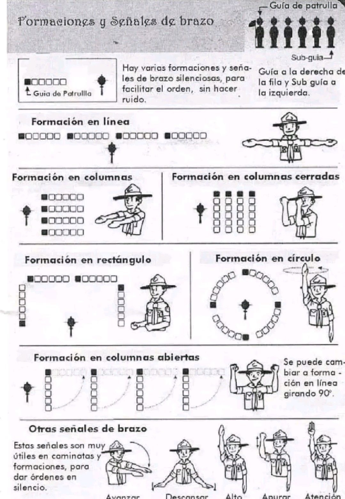
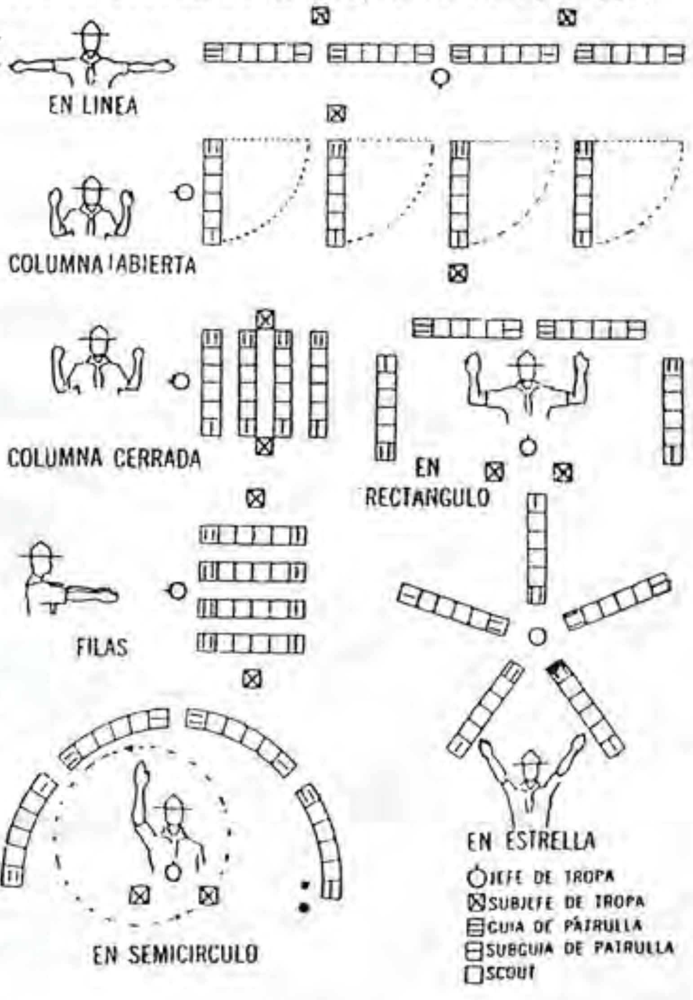
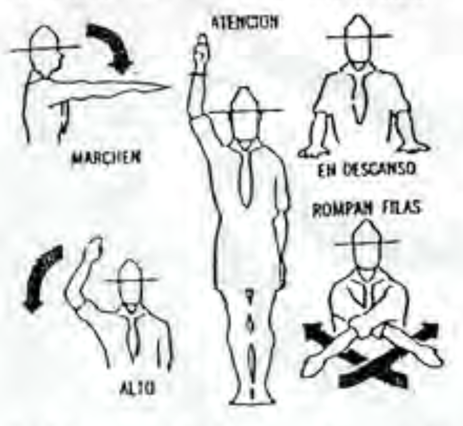
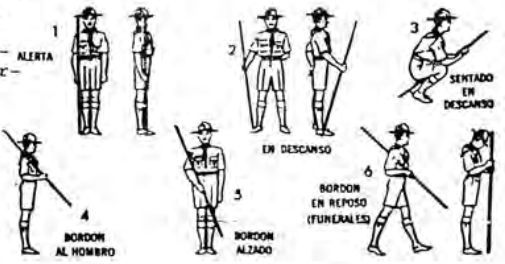

# Señalización

### Reuniones y Formaciones
Las señales de los brazos permiten al Scout moverse rápidamente de un lugar a otro en buen orden, evitando el ruido que ocasionan los gritos y los silbatazos.

En las formaciones el/la Guía se coloca al principio de la patrulla, le sigue el/la secretario(a), el/la tesorero(a)  y
los demás Scouts, y el/la último de todos será el/la Sub-Guía.

Deberás aprender las diferentes formaciones, son las siguientes:

- Alerta o Atención, 
- Rompan Filas, 
- En descanso,
- En Linea, 
- En Filas, 
- En Fila India, 
- En Columna (cerrada o abierta), 
- En Rectángulo, 
- En Semicírculo y,
- En Estrella.

Fijate bien en los dibujos. donde están bien representadas. Tu Guía o jefe de tropa deberan darte
todas las explicaciones necesarias y practicar con tu patrulla su ejecución.

<figure className="w-full my-4">
  
  <figcaption className="mt-2 text-sm text-left underline text-gray-500 dark:text-gray-400">Imágenes extraídas del Manual del Pietierno.</figcaption>
</figure>

### En formación con el bordón

A fin de establecer un sistema en el manejo del bordón durante las reuniones de Tropa, en una excursión o con motivo de una demostración al público, los Scouts deben hacer los siguientes ejercicios cuando portan su bordón:

- Alerta,
- En descanso,
- Sentado en descanso,
- Bordón al hombro,
- Bordón alzado,
- Bordón en reposo.

<figure className="w-full my-4">
  
  <figcaption className="mt-2 text-sm text-left underline text-gray-500 dark:text-gray-400">Imágenes extraídas del Manual del Pietierno.</figcaption>
</figure>

### Ordenes con sílbato

Al hacer las señales de sílbato, es preciso separar bien los toques largos de los cortos.

Un silbatazo de 4 segundos será un toque <ins>largo</ins> representado por una <ins>raya</ins>, en tanto que uno de un segundo será <ins>corto</ins> y se representará por un <ins>punto</ins>.
Observa bien el grabado y apréndelo de memoria.

| Señales                   | Representación          |  
| --------                  |  :-------:              | 
| Atención. Firmes.         | -                       | 
| Alto.                     | - -                     | 
| Auxilio. Socorro.         | . . . - - - . . .       |
| Entendido.                | . -                     |
| Peligro. Alerta.          | . . .                   |
| Reunirse. Llamada general | . - . - . -             |
| Reunión de Guías          | . . . -                 |

#### Bibliografías y Referencias: 

###### Enciso, A. (s.f.). Manual del Pietierno, Asociación de Scouts Dominicanos, Inc. 
